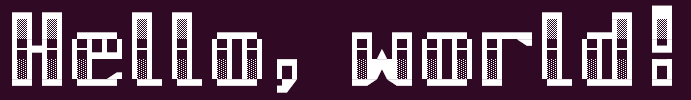

# Philippe Majerus's FIGfonts collection


## Introduction

This repository contains the fonts I created for the [FIGlet utility](http://www.figlet.org/).
While most FIGfonts are ASCII-art, I decided to experiment with ANSI/VT coloring, extended Unicode characters as sub-characters, …


## Fonts in this repository


### phm-smallvt


This is my main ANSI/VT-based font, containing over 500 characters.
This font uses extended ASCII characters from the US (437) codepage, and requires an ANSI/VT terminal that supports the underline escape sequence.

It works in FIGlet 2.2.5, but the width computation gets confused, so it requires `-w 9999` to avoid misplaced line breaks.
It does not work at all in TOIlet 0.3, as escape sequences get removed.

_Remember to use `figlet -f phm-smallvt -C utf8 -w 9999` to access Unicode characters and to avoid misplaced line breaks and broken VT control sequences due to bad width computation._


### hp2640-largetype


This is a FIGlet version of the example Large Type Pieces (Unicode 16.0) ASCII font provided by Hewlett-Packard in their HP 2641A/2645A/2645S Display Station Reference Manual, Table B-16.
It is a reference font for large type pieces introduced in Unicode 16.0 but only contains the 96 base ASCII characters.

It uses Unicode 16 Large Type Pieces (`U+1CE1A` to `U+1CE50`) and Quadrants to build a smooth set of characters using three rows. Its look depends on the font design, as large type pieces can be different in different fonts.

If you want to learn more about Large Type Pieces, try `curl https://raw.githubusercontent.com/PhMajerus/Documents/main/HowTos/HowTo%20Large%20Type%20Pieces.txt`.

This FIGfont requires the terminal to support Large Type Pieces characters to display properly, a font such as [Cascadia ≥2404.23](https://github.com/microsoft/cascadia-code) or [Iosevka ≥29.0.0](https://github.com/be5invis/Iosevka) is recommended.


### phm-largetype


This is my main Large Type Pieces (Unicode 16.0) font, containing over 1000 characters covering Latin-1, Latin Extended-A, some of Latin Extended-B and Extended Additional, superscripts, subscripts, small capitals, number forms, Greek, Cyrillic, Japanese half-width katakana, some mathematical operators and symbols, and more.

It uses Unicode 16 Large Type Pieces (`U+1CE1A` to `U+1CE50`) and Quadrants (including the centered variants) to build a smooth set of characters using three rows.
It also uses Sextants and Octants for some non-alphabetical characters such as outlined letters and 7-segment digits.

If you want to learn more about Large Type Pieces, try `curl https://raw.githubusercontent.com/PhMajerus/Documents/main/HowTos/HowTo%20Large%20Type%20Pieces.txt`.

This FIGfont requires the terminal to support Large Type Pieces characters to display properly, a font such as [Cascadia ≥2404.23](https://github.com/microsoft/cascadia-code) or [Iosevka ≥29.0.0](https://github.com/be5invis/Iosevka) is recommended.

_Remember to use `figlet -f phm-largetype -C utf8` to access Unicode characters._


### phm-largetype-ASCII


This is a subset of my Large Type Pieces font, but instead of using Unicode 16.0 characters, it uses the legacy alternate character set
found on HP 2640 Series terminals and compatibles.
This is used to create large type text on terminals that support an alternate character set for its ASCII characters.

SoftFonts (Soft Character Sets / DRCS) providing the Larget Type Pieces to DEC VT220, VT320, and VT420 terminals can be found in [my SoftFonts
collections](https://github.com/PhMajerus/Documents).

Note the character set must be selected and then restored when using this FIGfont, for example:
`echo -ne "\e( L"; figlet -f phm-largetype-ASCII -C utf8 "Hello, world!"; echo -ne "\e(B"`


### phm-lcdmatrix


This font uses Unicode 16.0 octants characters to create a monospaced retro low-rez font like on LCD and LED signboards, and 8-bit computers.
The characters are 6×8 pseudo-pixels, inspired by the Motorola MC6847 character generator, Tatung Einstein TC-01, TRS-80, and other computers of the 1980's.

It does not require an ANSI/VT terminal (does not use escape sequences) and works fine with FIGlet, but the terminal must support the octants characters.


### phm-blocky


This font uses extended ASCII characters from the US (437) codepage and ANSI/VT escape sequences for inverted (negative) characters.
It uses just two rows and supports the base ASCII characters set.

It works in FIGlet 2.2.5, but the width computation gets confused, so it can only be used for single lines. It requires `-w 9999` to avoid misplaced line breaks.
It does not work at all in TOIlet 0.3, as escape sequences get removed.

_Remember to use `figlet -f phm-blocky -w 9999` to avoid misplaced line breaks and broken VT control sequences due to bad width computation._


### phm-blocky-reverse


This font uses extended ASCII characters from the US (437) codepage.
It uses four rows and supports the base ASCII characters set.

Unlike phm-blocky, this reverse version does not require an ANSI/VT terminal (does not use escape sequences) and works fine with FIGlet, but the terminal must support the block elements found in codepage 473.
The equivalent font in non-reverse is not possible without help from ANSI/VT to invert (negative) some characters.


### phm-rounded


This font uses Unicode characters (Box Drawings lines, half lines, diagonals and arcs).
It uses four rows and supports the base ASCII characters set.


### phm-slanted


This font uses Unicode 13.0 smooth mosaic and sextant characters.
It uses six rows and supports the base ASCII characters set.


### beyond-blue


This font was designed by Strahd(ST) & Roy/SAC as `BEYONDX.TDF` for TheDRAW, an MS-DOS ANSI-art drawing application.
I converted it to a FIGlet font from the original file.
It uses the US (437) codepage and ANSI/VT escape sequences for colors to create large colorful 9-rows characters.

It works in FIGlet 2.2.5, but the width computation gets confused, so it can only be used for single lines. It requires `-w 9999` to avoid misplaced line breaks.
It does not work at all in TOIlet 0.3, as escape sequences get removed.

_Remember to use `figlet -f beyond-blue -w 9999` to avoid misplaced line breaks and broken VT control sequences due to bad width computation._


### PHM Beyond Neo (FIGfont family)

This font family is inspired by the look of ST+Roy/SAC Beyond, but using just 5 rows by taking advantage of Unicode 13.0 Symbols for Legacy Computing. It supports the ISO 8859-1 and Windows 1252 Latin-1 characters sets.
Several versions are available with different color schemes or compatible with plain-text.

#### phm-beyondneo-red; -green; -blue; -yellow; -purple; -cyan; -orange, -pink, -silver


These are the red, green, blue, yellow, purple, cyan, orange, pink, and silver color schemes of Beyond Neo.
They require 256 colors ANSI/VT escape sequences support.

They work in FIGlet 2.2.5, but the width computation gets confused, so they can only be used for single lines.
They require `-w 9999` to avoid misplaced line breaks.
They do not work at all in TOIlet 0.3, as escape sequences get removed.

_Remember to use `figlet -f phm-beyondneo-red -C utf8 -w 9999` to access Unicode characters (including ISO 8859-1) and to avoid misplaced line breaks and broken VT control sequences due to bad width computation._

#### phm-beyondneo-mono


This is the monochrome version of Beyond Neo. it is designed without any ANSI/VT escape sequence, making it compatible with plain-text and VT-unaware utilities.

_Remember to use `figlet -f phm-beyondneo-mono -C utf8` to access Unicode characters (including ISO 8859-1)._


## Using & installing FIGfonts
You'll need the FIGlet utility, so start with `sudo apt install figlet` or equivalent for your distro.
FIGfonts can be used as it by specifying their paths:
```bash
echo 'Hello, world!' | figlet -f /some_path/phm-largetype.flf -C utf8
```
The `-C utf8` option makes it support Unicode characters, handling the input as UTF-8.

But to make it cleaner and easier to use regularly, the font files can be copied to the FIGfont folder:
```bash
# Find out which directory contains figfonts
figlet -I2
# Copy font file(s) to that directory
sudo cp phm-largetype.flf /usr/share/figlet/phm-largetype.flf
# Use the FIGfont without having to specify the path or extension
echo 'Hello, world!' | figlet -f phm-largetype -C utf8
```

Note many of my fonts use ANSI/VT control sequences, which FIGlet does not support, making it miscalculate the width of characters. The workaround is to use the `-w 9999` argument to prevent it from wrapping text.
To create text that spans several lines, the `fold` utility can be used to prepare the text in advance.
For example:
```bash
uname -a | fold -sw 20 | figlet -f phm-beyondneo-red -w 9999 -C utf8
```
This takes the output of `uname`, formats it for lines of 20 characters max, breaking it at spaces instead of in words, then uses `figlet` to convert that to large colorful characters.

If you want to use only uppercase or lowercase letters from a font that supports both, convert the text in advance.
For example:
```bash
date | tr [:lower:] [:upper:] | figlet -f phm-slanted -w 130 -C utf8
date | tr [:upper:] [:lower:] | figlet -f phm-slanted -w 130 -C utf8
```

---

-- Philippe Majerus, September 2024

---

If you enjoy ANSI-art and Unicode semigraphics, also check out [my cowsay files collection](https://github.com/PhMajerus/CowFiles)
