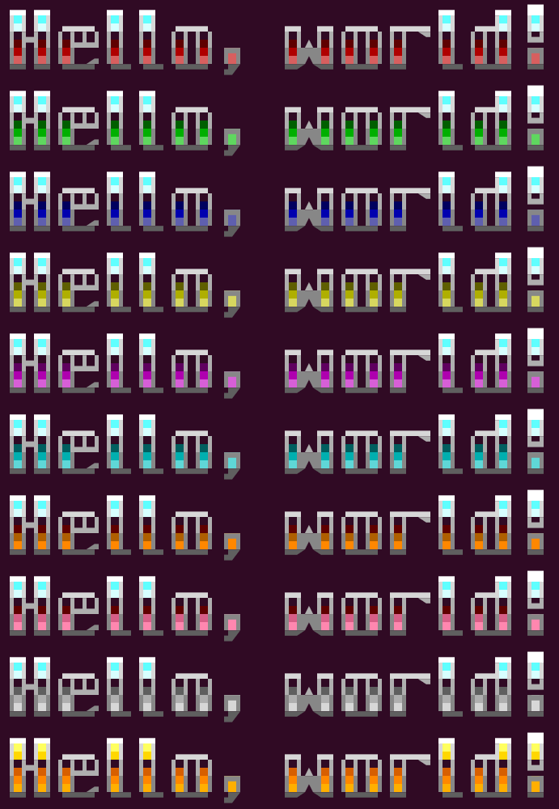

# Philippe Majerus’s FIGfonts collection


## Introduction

This repository contains the fonts I created for the [FIGlet utility](http://www.figlet.org/).
While most FIGfonts are ASCII-art, I decided to experiment with ANSI/VT coloring and extended Unicode characters as sub-characters to create denser characters. This makes them more suitable for use as titles and general text than the traditionally very large FIGfonts.
Also, many of them extend way beyond ASCII, supporting Latin-1, but sometimes also JIS X 0208 (Japanese), Emojis,… some contain thousands of characters.


## Fonts in this repository

| Font | Rows | Chars | Latin | International | More |
|:-----|---:|---:|:-----:|:-----:|:-----:|
|[phm-smallvt](#phm-smallvt)| 4 | 583 |ASCII + some extra Latin|Some Greek| |
|[hp2640-largetype](#hp2640-largetype)| 3 | 103 |ASCII| | |
|[phm-largetype](#phm-largetype)| 3 | 2570 |ISO 8859-1 + CP1252|Japanese Katakana|CP437 + more|
|[phm-lcdmatrix](#phm-lcdmatrix)| 2 | 104 |ASCII| | |
|[phm-minecraft](#phm-minecraft)| 2 | 220 |ISO 8859-1 + CP1252| | |
|[phm-c64](#phm-c64)| 2 | 184 |ASCII| |PETSCII|
|[phm-cga](#phm-cga)| 2 | 264 |ASCII| |CP437|
|[phm-vga](#phm-vga)| 4 | 264 |ASCII| |CP437|
|[phm-vga-square](#phm-vga-square)| 2 | 264 |ASCII| |CP437|
|[phm-dos](#phm-dos) | 4 | 627 |ISO 8859-1 + CP775 + CP850 + CP852 + CP857 + CP858 + CP860 + CP861 + CP863 + CP865 + CP1250 + CP1252 + CP1254 + CP1257|CP737 + CP869 + CP1253 (Greek) + CP855 + CP866 + CP1251 (Cyrillic)|CP437|
|[phm-hdos](#phm-hdos) | 4 | 2660 |ASCII|Korean KS X 1001 Hangul|CP437|
|[phm-dosv](#phm-dosv)| 4 | 7531 |ASCII|Japanese CP932| |
|[phm-shinonome](#phm-shinonome)| 3 | 12431 |ISO 8859-1 + CP1252 + more|Japanese CP932 + Jōyō + Jinmeiyō|Many Emojis|CP437|
|[phm-blocky](#phm-blocky) ([-reverse](#phm-blocky-reverse))| 2 (4) | 102 |ASCII| | |
|[phm-rounded](#phm-rounded)| 4 | 103 |ASCII| | |
|[phm-slanted](#phm-slanted)| 6 | 255 |ISO 8859-1 + CP1252| | |
|[phm-chisel](#phm-chisel)| 6 | 637 |ISO 8859-1 + CP1252|Japanese Katakana|✔︎|
|[beyond-blue](#beyond-blue)| 9 | 102 |ASCII| | |
|[phm-beyondneo-*](#phm-beyond-neo-figfont-family)| 5 | 3257 |ISO 8859-1 + CP1252|Japanese Katakana + a few Kanji|CP437 + Some Emojis|

### Latin encodings
Latin languages support can include
- ASCII - the base 7-bit ASCII character set
- CP437 - the original IBM PC and MS-DOS U.S. English character set, including ASCII, symbols, and semigraphics
- ISO 8859-1 Latin-1 - the standard Latin-1 alphabet (Basic Latin + Latin-1 Supplement Unicode blocks)
- CP1252 - the Windows extension to ISO 8859-1, adding some symbols and punctuation
- Unicode - includes many more latin letters for other languages, font can implement Latin Extended-A/B/C/D/E, Additional, IPA Extensions, Phonetic Extensions

Fonts that support both CP1252 (Latin‑1) and CP437 (US‑English) implicitly support the full printable repertoires of:
- CP850 (Multilingual Latin 1)
- CP858 (Multilingual Latin 1 + Euro sign)
- CP860 (Portuguese)
- CP861 (Icelandic)
- CP863 (Canadian French)
- CP865 (Nordic)
These code pages are supersets or near‑supersets of CP437/CP1252, requiring no additional glyphs beyond those already present.
Some font may include many more latin letters variations defined in Unicode to support more languages and phonetics.

### Japanese encodings
Japanese support exists in several increasing levels:
- JIS X 0201 — 8‑bit extension of ASCII containing half‑width katakana (and a Roman set identical to ASCII).
- JIS X 0208 — double‑byte set including Hiragana, Katakana, Greek, Cyrillic, 6355 Kanji, and many symbols.
- CP932 (Shift‑JIS / DOS/V) — extends JIS X 0208 with NEC PC‑98 and IBM DOS/V extensions, adding 361 extra Kanji and additional symbols.
- Unicode — includes tens of thousands of CJK ideographs, but fonts typically implement only the subset relevant to their intended use (e.g., Jōyō / Jinmeiyō coverage varies widely).

Because of this, Japanese support in FIGfonts can be described as:
- Katakana - JIS X 0201 kana, half‑width Katakana only
- Kana - full‑width Hiragana/Katakana only, often along with half-width Katakana for backward compatibility
- JIS X 0208 Kanji
- CP932 Kanji - JIS X 0208 Kanji + NEC & IBM extensions
- Jōyō Kanji and/or 常用漢字 2010 and Jinmeiyō kanji / 人名用漢字 - a few more than CP932 to support modern Japanese
- Unicode Kanji - additional ideographs beyond CP932, depending on intended font use

### Korean encodings
Korean support typically falls into four categories:
- Jamo — the 24 basic letters (choseong/jungseong/jongseong) used for algorithmic composition.
- Modern Hangul syllables — the 2350 commonly used syllables defined in KS X 1001, historically used by Hangeul MS‑DOS.
- Full Hangul syllables — the complete 11172 algorithmically defined syllables in Unicode.
- Hanja — the 1034 Hanja defined in KS X 1001, but many systems (including Korean MS‑DOS) did not include glyphs for them even though they were encodable.

Because of this, Korean support in FIGfonts can be described as:
- Jamo only
- KS X 1001 Hangul (2350 modern syllables)
- Full Hangul (all 11172 syllables)
- Hanja subset


## phm-smallvt


This is my main ANSI/VT-based font, containing over 500 characters.
This font uses extended ASCII characters from the US (437) codepage, and requires an ANSI/VT terminal that supports the underline escape sequence.

It works in FIGlet 2.2.5, but the width computation gets confused, so it requires `-w 9999` to avoid misplaced line breaks.
It does not work at all in TOIlet 0.3, as escape sequences get removed.

_Remember to use `figlet -f phm-smallvt -C utf8 -w 9999` to access Unicode characters and to avoid misplaced line breaks and broken VT control sequences due to bad width computation._


## hp2640-largetype


This is a FIGlet version of the example Large Type Pieces (Unicode 16.0) ASCII font provided by Hewlett-Packard in their HP 2641A/2645A/2645S Display Station Reference Manual, Table B-16.
It is a reference font for large type pieces introduced in Unicode 16.0 but only contains the 96 base ASCII characters. It is mostly intended as a historical reference for my own Large Type font below.

It uses Unicode 16 Large Type Pieces (`U+1CE1A` to `U+1CE50`) and Quadrants to build a smooth set of characters using three rows. Its look depends on the font design, as large type pieces can be different in different fonts.

If you want to learn more about Large Type Pieces, try `curl https://raw.githubusercontent.com/PhMajerus/Documents/main/HowTos/HowTo%20Large%20Type%20Pieces.txt`.

This FIGfont requires the terminal to support Large Type Pieces characters to display properly, a font such as [Cascadia ≥2404.23](https://github.com/microsoft/cascadia-code), [Cozette ≥1.27.0](https://github.com/the-moonwitch/Cozette), or [Iosevka ≥29.0.0](https://github.com/be5invis/Iosevka) is recommended.


## phm-largetype


This is my main Large Type Pieces (Unicode 16.0) font, containing 2570 characters covering ASCII, Latin-1, Latin Extended-A, Latin Extended-B, Latin Extended Additional, superscripts, subscripts, small capitals, number forms, Greek, Cyrillic, Japanese half-width Katakana (JIS X 0201), Braille, some mathematical operators and symbols, and more.

It uses Unicode 16 Large Type Pieces (`U+1CE1A` to `U+1CE50`) and Quadrants (including the centered variants) to build a smooth set of characters using three rows.
It also uses Sextants and Octants for some non-alphabetical characters such as outlined letters and 7-segment digits.
Note that because of the limited size, capital letters (uppercase) do not have accents, and small letter (lowercase) are missing some accents, such as marks appearing below characters.

If you want to learn more about Large Type Pieces, try `curl https://raw.githubusercontent.com/PhMajerus/Documents/main/HowTos/HowTo%20Large%20Type%20Pieces.txt`.

This FIGfont requires the terminal to support Large Type Pieces characters to display properly, a font such as [Cascadia ≥2404.23](https://github.com/microsoft/cascadia-code), [Cozette ≥1.27.0](https://github.com/slavfox/Cozette), or [Iosevka ≥29.0.0](https://github.com/be5invis/Iosevka) is recommended.

_Remember to use `figlet -f phm-largetype -C utf8` to access Unicode characters._


## phm-largetype-ASCII


This is a subset of my Large Type Pieces font, but instead of using Unicode 16.0 characters, it uses the legacy alternate character set
found on HP 2640 Series terminals and compatibles.
This is used to create large type text on terminals that support an alternate character set for its ASCII characters.

SoftFonts (Soft Character Sets / DRCS) providing the Larget Type Pieces to DEC VT220, VT320, and VT420 terminals can be found in [my SoftFonts
collections](https://github.com/PhMajerus/Documents).

Note the character set must be selected and then restored when using this FIGfont, for example:
`echo -ne "\e( L"; figlet -f phm-largetype-ASCII -C utf8 "Hello, world!"; echo -ne "\e(B"`


## phm-lcdmatrix


This font uses Unicode 16.0 octant characters to create a monospaced retro low-rez font like on LCD and LED signboards, and 8-bit computers.
The characters are 6×8 pseudo-pixels, inspired by the Motorola MC6847 character generator, Tatung Einstein TC-01, TRS-80, and other computers of the 1980's.

It does not require an ANSI/VT terminal (does not use escape sequences) and works fine with FIGlet, but the terminal must support the octant characters.


## phm-minecraft


This font uses Unicode 16.0 octant characters to recreate the Minecraft font by Mojang Studios.
It uses two rows and supports the Latin-1 characters (ISO 8859-1 and Windows codepage 1252).

It does not require an ANSI/VT terminal (does not use escape sequences) and works fine with FIGlet, but the terminal must support the octant characters.

_Remember to use `figlet -f phm-minecraft -C utf8` to access Unicode characters._


## phm-c64


This font uses Unicode 16.0 octant characters to recreate the original Commodore 64 character set as a large font.
The characters are 8×8 pseudo-pixels, rendered as 4×2 octant characters. It uses two rows and only includes characters originally found in the Commodore 64 chargen ROM. This means a few ASCII characters are missing, as PETSCII was based on an early version of ASCII.

It does not require an ANSI/VT terminal (does not use escape sequences) and works fine with FIGlet, but the terminal must support the octant characters.

_Remember to use `figlet -f phm-c64 -C utf8` to access Unicode characters._


## phm-cga


This font uses Unicode 16.0 octant characters to recreate the original IBM CGA bold character set as a large font. It is one of the original font for the launch of the IBM PC.
The characters are 8×8 pseudo-pixels, rendered as 4×2 octant characters. It uses two rows and supports codepage 437.

It does not require an ANSI/VT terminal (does not use escape sequences) and works fine with FIGlet, but the terminal must support the octant characters.

_Remember to use `figlet -f phm-cga -C utf8` to access Unicode characters._


## phm-vga


This font uses Unicode 16.0 octant characters to recreate the original IBM VGA character set for 80 columns × 25 lines mode as a large font. 
The characters are 8×16 pseudo-pixels, rendered as 4×4 octant characters. It uses four rows and supports codepage 437.
For most uses, the [phm-dos](#phm-dos) font is better, as it is almost identical but supports many more codepages and is based on the MS-DOS CPI software fonts.

It does not require an ANSI/VT terminal (does not use escape sequences) and works fine with FIGlet, but the terminal must support the octant characters.

_Remember to use `figlet -f phm-vga -C utf8` to access Unicode characters._


## phm-vga-square


Similar to phm-vga above, but based on the 80 columns × 50 lines mode, which are square characters.
The characters are 8×8 pseudo-pixels, rendered as 4×2 octant characters. It uses two rows and supports codepage 437.

It does not require an ANSI/VT terminal (does not use escape sequences) and works fine with FIGlet, but the terminal must support the octant characters.

_Remember to use `figlet -f phm-vga-square -C utf8` to access Unicode characters._


## phm-dos


This font uses Unicode 16.0 octant characters to recreate the original international Microsoft MS-DOS character sets.
This is probably the font most people remember as the MS-DOS-era font.
The characters are 8×16 pseudo-pixels, rendered as 4×4 octant characters. It uses four rows and supports most MS-DOS codepages:
- 437 (OEM - United States)
- 737 (OEM - Greek 437G)
- 775 (OEM - Baltic) - not supported by MS-DOS
- 850 (OEM - Multilingual Latin I) and ISO 8859-1 (Latin 1)
- 852 (OEM - Latin II)
- 855 (OEM - Cyrillic)
- 857 (OEM - Turkish)
- 858 (OEM - Multilingual Latin I + Euro)
- 860 (OEM - Portuguese)
- 861 (OEM - Icelandic)
- 863 (OEM - Canadian French)
- 865 (OEM - Nordic)
- 866 (OEM - Russian)
- 869 (OEM - Modern Greek)

And the following that do not exist in MS-DOS, but improve Windows compatibility:
- 1250 (ANSI - Central Europe)
- 1251 (ANSI - Cyrillic)
- 1252 (ANSI - Latin I)
- 1253 (ANSI - Greek)
- 1254 (ANSI - Turkish)
- 1257 (ANSI - Baltic)

Some character sets provided by MS-DOS `EGA*.CPI` contained different designs for the same Unicode character. This FIGfont unifies them to be as consistent as possible when used for mixed languages text.
Korean and Japanese versions of MS-DOS contained completely different character sets - see the separate [phm-hdos (based on Hangeul / 한글 MS-DOS)](#phm-hdos) and [phm-dosv (based on Japanese MS-DOS/V)](#phm-dosv) below.

It does not require an ANSI/VT terminal (does not use escape sequences) and works fine with FIGlet, but the terminal must support the octant characters.

_Remember to use `figlet -f phm-dos -C utf8` to access Unicode characters._


## phm-hdos


This font uses Unicode 16.0 octant characters to recreate the original Microsoft Hangeul / 한글 MS-DOS character set.
This is the font used on Korean versions of MS-DOS which support modern Hangul / 한글.
Just like [phm-dos](#phm-dos) above is probably the font most people remember as the MS-DOS-era font, this is the one Korean users remember.
The characters are 8×16 pseudo-pixels for half-width and 16×16 pseudo-pixels for full-width, rendered as 4×4 and 8×4 octant characters respectively. It uses four rows and supports what MS-DOS used to call code page 949, but which was really a subset of what would later be code page 51949, not the Windows CP949.
Note Korean/한글 MS-DOS did not support the full KS X 1001 standard with special characters, Greek, Hiragana, Katakana, Cyrillic, and Hanja.

For people not familiar with Korean/한글 MS-DOS, it contained a text-mode display driver that could render Jamo and Hangul along with the standard U.S. English CP437. This font is based on the original glyphs generated by `HFONT.SYS`.
This includes the full IBM PC extended ASCII (CP437), 51 modern Jamo, and 2350 modern Hangul syllables, for a total of 2660 characters.

It does not require an ANSI/VT terminal (does not use escape sequences) and works fine with FIGlet, but the terminal must support the octant characters.

_Remember to use `figlet -f phm-hdos -C utf8` to access Unicode characters._


## phm-dosv


This font uses Unicode 16.0 octant characters to recreate the original Microsoft Japanese DOS/V character set.
This is the font used on Japanese versions of IBM PC-DOS and MS-DOS with support for code page 932 (Shift-JIS).
Just like [phm-dos](#phm-dos) above is probably the font most people remember as the MS-DOS-era font, this is the one Japanese users remember.
The characters are 8×16 pseudo-pixels for half-width and 16×16 pseudo-pixels for full-width, rendered as 4×4 and 8×4 octant characters respectively. It uses four rows and supports codepage 932.

For people not familiar with DOS/V, it contained a special text-mode display driver as well as a software font to be able to render multi-byte character sets (MBCS) such as CP932. This made it possible to support thousands of ideographs (kanji) required by JIS X 0208.
This font is based on the original glyphs from `ANK16.FNT` and `KANJI16.FNT`, which together make the Japanese software font from MS-DOS 6.2/V, and contains all of the characters supported by CP932.
That includes all JIS X 0208 kanji (2965 level 1 kanji + 3390 level 2 kanji + 仝 = 6356 ideographs), and NEC PC-98 and IBM DOS/V extensions (361 kanji). This makes it one of the largest FIGlet font ever, with a total of 7531 characters, second only to phm-shinonome below.

It does not require an ANSI/VT terminal (does not use escape sequences) and works fine with FIGlet, but the terminal must support the octant characters.

_Remember to use `figlet -f phm-dosv -C utf8` to access Unicode characters._


## phm-shinonome


phm‑shinonome uses Unicode 16.0 octant characters to display the monospace Shinonome12 / 東雲12 (Shinonome 12‑dot Gothic/sans‑serif) bitmap font, originally designed by Yasuyuki Furukawa / 古川 泰之様 and released into the public domain.
Shinonome was widely used on early Japanese Unix X11 environments (FreeBSD, Linux), and this FIGfont preserves its look while expanding it into a fully modern, compatibility‑complete design.

It uses three rows of characters built from 6×12 pseudo‑pixels for half‑width and 12×12 pseudo‑pixels for full‑width, rendered as 3×3 and 6×3 octant matrices.

Because a FIGfont is never a primary text font but a title‑sized companion to the user’s terminal or editor font, phm‑shinonome is designed for full parity with modern terminal and editor coverage.
Any text that renders correctly in the terminal should also render correctly when piped through figlet using this font, without missing glyphs.
This guarantees that scripts and utilities outputs can be safely "upscaled" into large ASCII‑art titles.

**Japanese compatibility**
- JIS X 0201 (half‑width)
- JIS X 0208 (2965 level‑1 + 3390 level‑2 kanji + 仝 = 6356 ideographs)
- NEC PC‑98 and IBM DOS/V extensions (361 additional ideographs and symbols)
- Jinmeiyō kanji / 人名用漢字 (37 additional ideographs to support all 863)
- Jōyō kanji / 常用漢字 2010 (4 additional ideographs to support all 2136)
- Full CP932 parity (MS-DOS/Windows Japanese Shift‑JIS)
- MS Gothic / ＭＳ ゴシック 2.0 parity (except for non-Japanese ideographs), ensuring compatibility with Japanese Windows console (Windows 2000 → XP), and most of current 5.32 characters (Windows Vista → 11, only missing some arrows and symbols)

**Western and legacy compatibility**
- MS‑DOS CP437 (IBM PC / en‑US) and CP850 (Latin 1)
- ISO 8859‑1 and Windows CP1252 (Latin 1)
- Symbols and characters historically present in MS Gothic (Windows 3.1 → XP), including Greek and Cyrillic
- Lucida Console 5.01 parity, ensuring compatibility with Western Windows console (Windows NT4 → Vista)
- Cascadia 2407.24 parity, ensuring compatibility with Windows Terminal and Visual Studio (Windows 10 → 11)

**Modern additions**
- Braille, block mosaic patterns, block diagonals, large type pieces, and some other Symbols for Legacy Computing
- More Latin letters (Full Latin-1 Supplement, Latin Extended-A, Latin Extended-B, IPA Extensions, Phonetic Extensions, Latin Extended Additional, and Latin Extended-C blocks)
- A growing set of emojis (800 so far)
- Additional symbols and pictographs

With 12431 characters, phm‑shinonome is probably the largest FIGlet font ever created, unifying Japanese, Western, and semigraphic bitmap lineages into a single Unicode‑coherent design.

It does not require an ANSI/VT terminal (does not use escape sequences) and works fine with FIGlet, but the terminal must support the octant characters.

_Remember to use `figlet -f phm-shinonome -C utf8` to access Unicode characters._


## phm-blocky


This font uses extended ASCII characters from the US (437) codepage and ANSI/VT escape sequences for inverted (negative) characters.
It uses just two rows and supports the base ASCII characters set.

It works in FIGlet 2.2.5, but the width computation gets confused, so it can only be used for single lines. It requires `-w 9999` to avoid misplaced line breaks.
It does not work at all in TOIlet 0.3, as escape sequences get removed.

_Remember to use `figlet -f phm-blocky -w 9999` to avoid misplaced line breaks and broken VT control sequences due to bad width computation._


## phm-blocky-reverse


This font uses extended ASCII characters from the US (437) codepage.
It uses four rows and supports the base ASCII characters set.

Unlike phm-blocky, this reverse version does not require an ANSI/VT terminal (does not use escape sequences) and works fine with FIGlet, but the terminal must support the block elements found in codepage 473.
The equivalent font in non-reverse is not possible without help from ANSI/VT to invert (negative) some characters.


## phm-rounded


This font uses Unicode characters (Box Drawings lines, half lines, diagonals and arcs).
It uses four rows and supports the base ASCII characters set.


## phm-slanted


This font uses Unicode 13.0 smooth mosaic and sextant characters.
It uses six rows and supports the ASCII, ISO 8859-1 and Windows 1252 Latin-1 character sets.

_Remember to use `figlet -f phm-slanted -C utf8` to access Unicode characters._


## phm-chisel


This font uses Unicode 13.0 smooth mosaic and sextant characters, as well as some quadrants, and requires 16 colors ANSI/VT escape sequences support, and uses six rows.
It contains 637 characters, and supports the ASCII, ISO 8859-1 and Windows 1252 Latin-1 characters sets, and Japanese Katakana (and Hiragana as Katakana).

It works in FIGlet 2.2.5, but the width computation gets confused, so it can only be used for single lines. It requires `-w 9999` to avoid misplaced line breaks.
It does not work at all in TOIlet 0.3, as escape sequences get removed.

Note you can use the [`sed` (stream editor) utility](https://en.wikipedia.org/wiki/Sed) to replace colors.
The font uses colors `97` and `107` for highlight, `37` and `47` for light, and `90` and `100` for shadow. Always set both foreground and background colors of the same brightness to the same color.
The following set of replacements will change the 3 original grays to red (`31` and `41`), green (`32` and `42`), and yellow/brown (`33` and `43`):
```bash
hostname | figlet -f phm-chisel -C utf8 -w 9999 -n | sed -e 's/97/31/g;s/107/41/g;s/37/32/g;s/47/42/g;s/90/33/g;s/100/43/g'
```
<p><details><summary>
It is also possible to use 256-colors or 24-bit colors for finer control.
Here are replacements commands for common colors gradients using the 256-colors palette:

_(Expand for commands to use for red, green, blue, yellow, purple, cyan, orange, pink, and silver color schemes.)_
</summary>

| Color | Command |
|---|---|
| Red | `sed -e 's/97/38;5;210/g;s/107/48;5;210/g;s/37/38;5;167/g;s/47/48;5;167/g;s/90/38;5;124/g;s/100/48;5;124/g'` |
| Green | `sed -e 's/97/38;5;120/g;s/107/48;5;120/g;s/37/38;5;77/g;s/47/48;5;77/g;s/90/38;5;34/g;s/100/48;5;34/g'` |
| Blue | `sed -e 's/97/38;5;103/g;s/107/48;5;103/g;s/37/38;5;61/g;s/47/48;5;61/g;s/90/38;5;19/g;s/100/48;5;19/g'` |
| Yellow | `sed -e 's/97/38;5;228/g;s/107/48;5;228/g;s/37/38;5;185/g;s/47/48;5;185/g;s/90/38;5;142/g;s/100/48;5;142/g'` |
| Purple | `sed -e 's/97/38;5;212/g;s/107/48;5;212/g;s/37/38;5;170/g;s/47/48;5;170/g;s/90/38;5;127/g;s/100/48;5;127/g'` |
| Cyan | `sed -e 's/97/38;5;123/g;s/107/48;5;123/g;s/37/38;5;80/g;s/47/48;5;80/g;s/90/38;5;37/g;s/100/48;5;37/g'` |
| Orange | `sed -e 's/97/38;5;215/g;s/107/48;5;215/g;s/37/38;5;208/g;s/47/48;5;208/g;s/90/38;5;130/g;s/100/48;5;130/g'` |
| Pink | `sed -e 's/97/38;5;218/g;s/107/48;5;218/g;s/37/38;5;211/g;s/47/48;5;211/g;s/90/38;5;168/g;s/100/48;5;168/g'` |
| Silver | `sed -e 's/97/38;5;231/g;s/107/48;5;231/g;s/37/38;5;188/g;s/47/48;5;188/g;s/90/38;5;145/g;s/100/48;5;145/g'` |

</details></p>

_Remember to use `figlet -f phm-chisel -C utf8 -w 9999` to access Unicode characters and to avoid misplaced line breaks and broken VT control sequences due to bad width computation._


## beyond-blue


This font was designed by Strahd(ST) & Roy/SAC as `BEYONDX.TDF` for TheDRAW, an MS-DOS ANSI-art drawing application.
I converted it to a FIGlet font from the original file.
It uses characters from the US (437) codepage and ANSI/VT escape sequences for colors to create large colorful 9-rows characters.

The original TDF file contained several color schemes, but I only converted the blue one for now, as it is mostly intended as a historical reference for my own Beyond Neo font below.

It works in FIGlet 2.2.5, but the width computation gets confused, so it can only be used for single lines. It requires `-w 9999` to avoid misplaced line breaks.
It does not work at all in TOIlet 0.3, as escape sequences get removed.

_Remember to use `figlet -f beyond-blue -w 9999` to avoid misplaced line breaks and broken VT control sequences due to bad width computation._


## PHM Beyond Neo (FIGfont family)

This font family is inspired by the look of ST+Roy/SAC Beyond, but using just 5 rows by taking advantage of Unicode 16.0 Symbols for Legacy Computing. It contains 3257 characters, and supports the ASCII, ISO 8859-1 and Windows 1252 Latin-1 characters sets, Greek, Cyrillic, Japanese Katakana (and Hiragana as Katakana), 139 ideographs (mostly for dates, times, places, and numbers in Chinese numerals), 330 color symbols and emojis, and more.
Several versions are available with different color schemes or compatible with plain-text.

### phm-beyondneo-red; -green; -blue; -yellow; -purple; -cyan; -orange, -pink, -silver, -gold


These are the red, green, blue, yellow, purple, cyan, orange, pink, silver, and gold color schemes of Beyond Neo.
They require 256 colors ANSI/VT escape sequences support.

They work in FIGlet 2.2.5, but the width computation gets confused, so they can only be used for single lines.
They require `-w 9999` to avoid misplaced line breaks.
They do not work at all in TOIlet 0.3, as escape sequences get removed.

If the background color is close to white, the grays can be shifted to go from light gray to black instead of white to dark gray using the [`sed` (stream editor) utility](https://en.wikipedia.org/wiki/Sed).
```bash
figlet -f phm-beyondneo-gold -C utf8 -w 9999 "Test" | sed -e 's/38;5;59/38;5;16/g;s/48;5;59/48;5;16/g;s/38;5;102/38;5;59/g;s/48;5;102/48;5;59/g;s/38;5;145/38;5;102/g;s/48;5;145/48;5;102/g;s/38;5;188/38;5;145/g;s/48;5;188/48;5;145/g;s/38;5;231/38;5;188/g;s/48;5;231/48;5;188/g'
```

_Remember to use `figlet -f phm-beyondneo-red -C utf8 -w 9999` to access Unicode characters (including ISO 8859-1) and to avoid misplaced line breaks and broken VT control sequences due to bad width computation._

### phm-beyondneo-mono


This is the monochrome version of Beyond Neo. it is designed without any ANSI/VT escape sequence, making it compatible with plain-text and VT-unaware utilities.

_Remember to use `figlet -f phm-beyondneo-mono -C utf8` to access Unicode characters (including ISO 8859-1)._


## Using & installing FIGfonts
You'll need the FIGlet utility, so start with `sudo apt install figlet` or equivalent for your distro.
FIGfonts can be used as it by specifying their paths:
```bash
echo 'Hello, world!' | figlet -f /some_path/phm-largetype.flf -C utf8
```
The `-C utf8` option makes it support Unicode characters, handling the input as UTF-8.

But to make it cleaner and easier to use regularly, the font files can be copied to the FIGfont folder:
```bash
# Find out which directory contains figfonts
figlet -I2
# Copy font file(s) to that directory
sudo cp phm-largetype.flf /usr/share/figlet/phm-largetype.flf
# Use the FIGfont without having to specify the path or extension
echo 'Hello, world!' | figlet -f phm-largetype -C utf8
```

Note many of my fonts use ANSI/VT control sequences, which FIGlet does not support, making it miscalculate the width of characters. The workaround is to use the `-w 9999` argument to prevent it from wrapping text.
To create text that spans several lines, the `fold` utility can be used to prepare the text in advance.
For example:
```bash
uname -a | fold -sw 20 | figlet -f phm-beyondneo-red -w 9999 -C utf8
```
This takes the output of `uname`, formats it for lines of 20 characters max, breaking it at spaces instead of in words, then uses `figlet` to convert that to large colorful characters.

If you want to use only uppercase or lowercase letters from a font that supports both, convert the text in advance (or use `-C upper`).
For example:
```bash
date | tr [:lower:] [:upper:] | figlet -f phm-slanted -w 130 -C utf8
date | tr [:upper:] [:lower:] | figlet -f phm-slanted -w 130 -C utf8
```

FIGlet does not support decomposed Unicode text. It processes each code point independently and has no mechanism for combining base letters with combining marks.
If your input contains characters that do have precomposed equivalents in Unicode, you should normalize the text to NFC before piping it to FIGlet so that those precomposed characters can be matched by the FIGlet font if it contains them.
For example:
```bash
echo "tiếng Việt" | uconv -x '::NFC;' | figlet -f phm-shinonome -C utf8
```
Note that normalization only composes characters when a precomposed form actually exists in Unicode.
Sequences with multiple combining marks may remain decomposed, and FIGlet cannot render them because it treats each combining mark as an independent, unsupported character.

---

-- Philippe Majerus, October 2024 to February 2026

---

If you enjoy ANSI-art and Unicode semigraphics, also check out [my cowsay files collection](https://github.com/PhMajerus/CowFiles).
